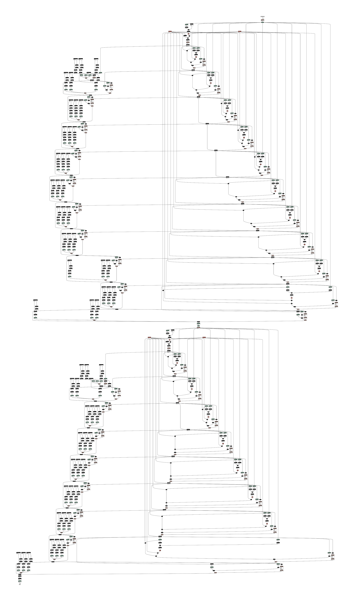

# esp32s3_eye_kws_demo

Speech recognition is based on [this](https://github.com/microsoft/EdgeML/blob/master/docs/publications/Sha-RNN.pdf)
architecture and examples from the same repository. The cell type in this model is [FastRNN](https://github.com/microsoft/EdgeML/blob/master/docs/publications/FastGRNN.pdf).
The inference with this model takes around 120ms.
More detailed breakdown:

| Operation                 | Time [ms] |
|---------------------------|-----------|
| Preemphasis + DC blocking | <1ms |
| Mel filterbank | 20ms |
| Power spectrum (mainly FFT) | 70ms |
| NN inference | 30ms |
| **Total** | **~121ms** |

The inference is run every 250ms, so four times a second.
FFT is the bottleneck now!

A bigger, LSTM-based model with ~550ms inference time can be found [here](https://github.com/mryndzionek/esp32s3_eye_kws_demo/tree/lstm_model).
It is slightly more accurate, especially to the `up` label.

https://github.com/user-attachments/assets/861b4d5a-1f38-4653-9b4f-e0f713c1e0ba

## Notes

Number of TinyML model conversion frameworks were tested,
but none gave satisfactory results. The main problem seems
to be that the graphs exported from PyTorch (or other
training-oriented NN frameworks) contain much additional
information needed only for training, but information
which obscures the essential structure needed only for inference.
Here is for example a ONNX graph exported directly from PyTorch:

and [this](https://github.com/mryndzionek/esp32s3_eye_kws_demo/blob/main/main/fast_rnn.c) is
all the "manually-transpiled" code needed for inference (~160 LoCs of C) ...

